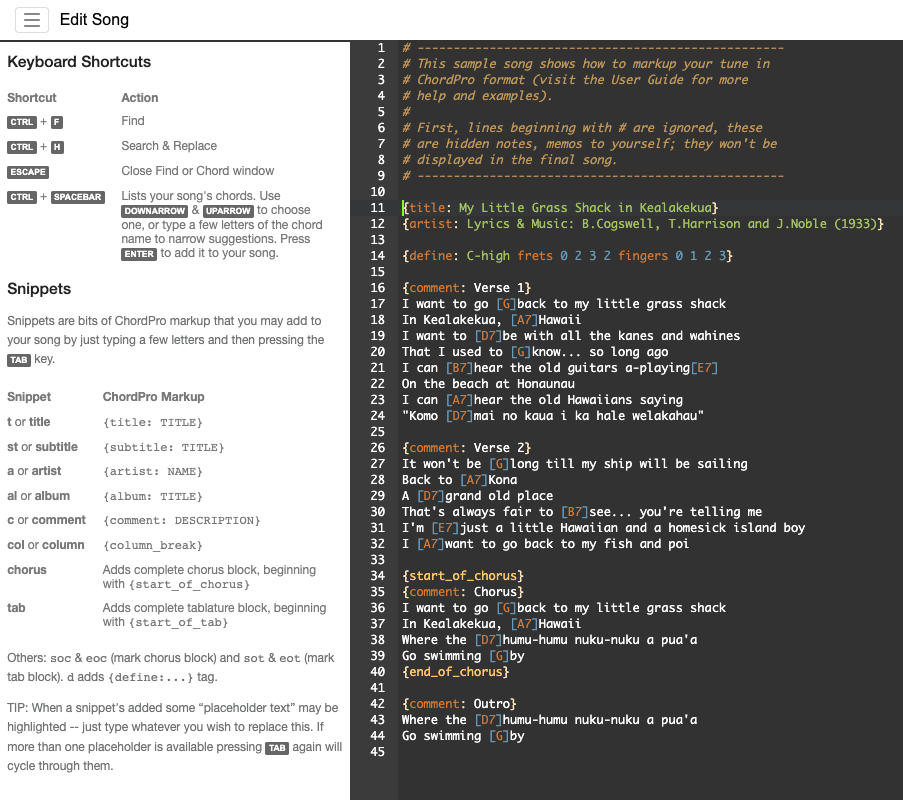

# UkeGeeks Ace Editor ChordPro Language Extension

ChordPro song editing extension for the [Ace Editor](https://ace.c9.io/) (version 1.27.0).

Try the [Live Demo](https://buzcarter.github.io/ace-chordpro-extension/editor.html) (includes Help tips)

For a basic setup look at [Live Basic Install](https://buzcarter.github.io/ace-chordpro-extension/basic.html)

**Important:** *This is early stages of updating the UkeGeek's Scriptasaurus Song Editor, as such,
this is an alpha test release: the final installation & usage is likely to change greatly.*



## Installation

```
npm install @ukegeeks/ace-chordpro-extension
```

## Demo

Load "editor.html" (includes help sidebar) in your browser.

Currently the `define` & `tab` statements auto-complete snippet defaults to four strings (for ukulele fans out there)

## Usage

Load "basic.html" (a barebones usage) in your browser.

```js
const EDITOR_ID = 'songEditor';

// Let Ace know where it should inject itself on the page,
// it will grab the contents within this elemtn (`<pre/>`)
const editor = window.ace.edit(EDITOR_ID);

// choose a color scheme (see Ace prebuilts for dozens of choices)
editor.setTheme('ace/theme/idle_fingers');

// Now we tell Ace to treat our text as ChordPro
editor.session.setMode('ace/mode/chordpro');
editor.setOptions({
    enableBasicAutocompletion: true,
    enableSnippets: true,
});
```

## License

This library is licensed under [GNU General Public License](http://www.gnu.org/licenses/gpl.html).

Use it, change it, fork it, but please leave the author attribution.
